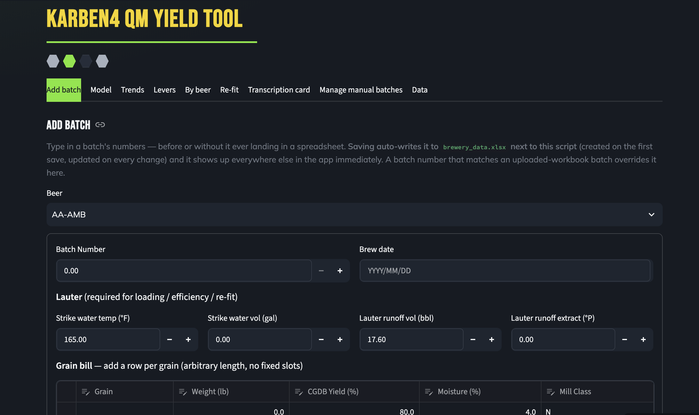

# QM Yield Tool — Karben4 Brewing

**A production yield-analysis tool built for a working brewery, and handed over in person.**

Summer 2026 · Quality Engineering internship at [Karben4 Brewing](https://karben4.com), Madison WI
· Keshav Shah ([LinkedIn](https://www.linkedin.com/in/keshavsshah/))



*Batch entry. The tabs across the top are the rest of the tool: model fit, trends, sensitivity levers, per-beer breakdowns, re-fitting, and a transcription card for the brewery's paper logs.*

---

## What this project was

Karben4's quality team tracked brewhouse yield — how much extract is actually recovered
from each batch — in a set of Excel/Solver workbooks. They worked, but they were rigid:
fixed slots for grain types, hand-maintained formulas, and no way to see how yield
*develops* through the lauter without rebuilding a chart by hand.

I replaced them with a tool the Quality Manager runs himself.

**What it does**
- Models the **lauter runoff curve** batch by batch — first runnings through total runoff —
  so yield loss becomes visible as a shape, not a single number at the end.
- Ports the full **volume cascade** the workbooks encoded: lauter and sugar additions →
  end-of-boil → trub and hop losses → predicted knockout → cellar losses → packaging.
- Accepts **any number of grain types and lots per batch**. The old workbook had rigid
  3×3 slots; real brew days do not.
- Auto-fits process parameters from batch actuals and summarizes **trends for recipe
  formulation**.

**What made it real rather than a demo**
- **Correctness is pinned to the source of truth.** Golden-reference tests replay all 50
  Brewhouse batches and 41 Cellar batches from the brewery's own workbook and assert the
  engine reproduces Excel's cached values exactly (agreement to ~1e-16 on the extract
  chain). The engine was not allowed to be "close."
- **It is deployed and access-controlled** — hosted, gated behind Karben4's Microsoft
  Entra SSO, so only brewery accounts get in.
- **Data is durable and lives where the brewery already works** — both source workbooks
  load themselves from the brewery's SharePoint, and hand-entered batches save back there.
- **It was handed over, not just delivered.** It ships with a printable Quality Manager
  handbook (install, daily use, troubleshooting), and on my last day the QM and I walked a
  real batch through it end to end. The tool is his now.

**Engineering notes** — the calculation engine is pure and I/O-free, which is what made the
golden-reference testing possible; the Streamlit layer, storage adapters, and auth are all
separable from it. The technical documentation below is written for the people who operate
and maintain the tool, and is kept as it was delivered.

**Stack** — Python · Streamlit · pandas/numpy · Microsoft Entra ID (OIDC) · Microsoft Graph
/ SharePoint · openpyxl · Docker

> This repository is my personal portfolio copy. The brewery's working copy lives in
> Karben4's own organization.

---

> The single-user **Python/Streamlit** brewery/lauter-yield tool for the Quality Manager.
> Scope: **Scope v2** · math: **Formula Spec** · root: **Karben4-Lauter-Yields-MOC**

> **📖 Just want to run it?** See **[SETUP.md](SETUP.md)** — a plain-English, step-by-step Windows install/run guide for the Quality Manager (durable local data). **Quality Manager?** Start with **[QM_HANDBOOK.md](QM_HANDBOOK.md)** — install, daily use, and troubleshooting in one printable doc.

**Or just use the hosted link — nothing to install:** **https://karben4-qm-yield-tool.streamlit.app/**
Sign in with your Karben4 M365 account. Both source workbooks load themselves from SharePoint and
hand-entered batches save there permanently — the hosted app is now fully durable (verified 2026-08-05).

## Why it exists
A flexible, batch-actuals-driven replacement for the brewery's Excel/Solver yield workbooks. Handles the real **grain & hop variability** (any number of grain types/lots per batch — no rigid 3×3 slots), auto-fits parameters, and summarizes **trends for recipe formulation**. Brewers don't interact; the QM is the only user.

## Files
- [engine.py](engine.py) — pure calculation engine. **Increment 1** (lauter/extract chain + runoff curve): arbitrary-length grain bill is the core design point. **Increment 2** (volume cascade): `knockout_metrics()` ports the Brewhouse tab (lauter runoff + sugar additions → end-of-boil → trub/hop losses → predicted knockout volume); `cellar_metrics()` ports the Cellar tab (FV wort → yeast/trub + dry-hop + cellar-process losses → predicted centrifuge-out → packaging loss). No I/O.
- [test_engine.py](test_engine.py) — golden-reference test for increment 1: builds each beer's real multi-grain bill from the workbook and asserts the engine reproduces Excel.
- [test_volume_cascade.py](test_volume_cascade.py) — golden-reference test for increment 2: replays all 50 Brewhouse batches + 41 Cellar batches (39 with a packaging check) from `Brewery_Yields.xlsx` through `knockout_metrics()`/`cellar_metrics()` and asserts exact reproduction of Excel's cached formula values.
- [data_loader.py](data_loader.py) — increment 3: reads both workbooks into a `Batch` object per Batch Number (grains + lauter from `Lauter_Checks_2`, knockout + cellar from `Brewery_Yields`), joined across sources. Workbook import only for now — no Ekos CSV path yet (no confirmed self-serve API).
- [analysis.py](analysis.py) — increment 4 support: pure function `batch_dataframe()` runs every loaded `Batch` through the engine and flattens it into one row (incl. per-grain composition %), no Streamlit dependency — testable standalone.
- [app.py](app.py) — increment 4 (+ increment 5 wiring + manual batch entry): the Streamlit UI. 8 tabs — **Data** (the joined table, filtered to selected beers by default — not a full 72-row dump), **Trends** (metric vs. batch, recipe-formulation framing, no alerts/SPC), **Levers** (efficiency vs. loading/thickness scatter + correlation, echoes the DOE's confound), **By beer** (per-beer batch history), **Re-fit** (autofit.py's output, with a retention_pct slider for live sensitivity exploration + CSV export), **Transcription card** (one batch's computed values, rounded for hand-copying into paper brewlogs/Ekos), **Add batch** (manual entry form — grain bill via an editable table, optional knockout/cellar sections), **Manage manual batches** (list + delete what's been added by hand).
- [autofit.py](autofit.py) — increment 5: replaces the Excel Solver for fitting per-batch `LauterParams` (FRE_pct, retention_pct). Bisection-exact, dependency-free. **Deliberately simpler than Excel's Solver** — see the module docstring for why (one measured point per batch can't identify two free parameters; retention is held at a fixed empirical default instead of jointly regression-fit across beers, which is the part of Excel's approach already shown to be overfit/confounded).
- [workbook_store.py](workbook_store.py) — **the durable batch store (2026-07-07).** Hand-entered batches auto-save to `brewery_data.xlsx` next to the app: created on the first save, rewritten on every add/edit/delete, and read back on launch — so **data persists between batches and sessions with no manual export**. Human-readable two-sheet layout (`Batches` one row per batch + `Grains` one row per grain) that round-trips the full `Batch` (variable-length grain bills, None-vs-present stages). Migrates an old `manual_batches.json` in automatically on first run. A manual batch overrides an uploaded-workbook batch with the same Batch Number. This is the one place the app **writes** anything. ⚠️ Durable on a real disk (local run); ephemeral on Streamlit Cloud.
- [sharepoint_store.py](sharepoint_store.py) — **SharePoint-backed durable store — LIVE in production since 2026-08-05** (added 2026-07-07; still optional in code — no `MS_*` creds means it falls back to `workbook_store`). Same interface as `workbook_store` but reads/writes `brewery_data.xlsx` in a **SharePoint document library via Microsoft Graph** (app-only auth, reuses `onedrive.py`). When Karben4's Microsoft 365 creds are configured (Streamlit Secrets / env), the app uses this automatically so **the hosted link keeps data durably** and the team can open the file in Excel Online; otherwise it falls back to the local `workbook_store`. Setup: see [DEPLOYMENT_RUNBOOK.md](DEPLOYMENT_RUNBOOK.md) Phase 3B (what to request from Karben4 IT + the config values).
- `batch_store.py` — *deleted 2026-07-14 (ponytail audit).* Original JSON-backed manual-batch store, superseded by `workbook_store.py` on 2026-07-07; the `manual_batches.json → brewery_data.xlsx` migration it seeded now lives in `workbook_store._migrate_legacy_json()`. Nothing imported it, so it was removed.
- [display.py](display.py) — shared column labels/widths/number formats (`column_config()`) so every tab's tables use human-readable headers ("Loading (kg/m²)" not `lauter_loading_kgm2`) sized to fit, instead of each page guessing independently.
- [Dockerfile](Dockerfile) — containerizes the app; optional deployment path (see Deployment below).
- [requirements.txt](requirements.txt) — pinned Python deps for Docker / Streamlit Community Cloud.
- 🚀 **[DEPLOYMENT_RUNBOOK.md](DEPLOYMENT_RUNBOOK.md) — the one doc to follow to go live (2026-07-14).** Exact ordered path (Phase 0–6) consolidating DEPLOY + SHAREPOINT_SETUP + SSO_LOGIN_SETUP + IT Walkthrough into a single checklist with owner tags (Keshav / IT / Leadership): Karben4 GitHub org → first deploy (open) → get URL → one Entra app (Sites.Selected + Web redirect + openid/profile/email) → paste secrets → verify → lock down/offboarding.
- [onedrive.py](onedrive.py) — optional Microsoft Graph / OneDrive-SharePoint auto-fetch of the two source workbooks (env vars or Streamlit Cloud secrets); not required for local use.
- [auth.py](auth.py) — **Karben4 SSO login gate — LIVE in production since 2026-07-22** (still optional in the code: no `[auth]` secrets → the app runs open, which is how local installs behave). Streamlit native OIDC (`st.login`/`st.user`/`st.logout`) pointed at **Microsoft Entra**: when the `[auth]` secrets block is present, only signed-in **Karben4 M365 accounts** (single-tenant + optional `allowed_domains`) can open the app — a branded login screen hides everything until sign-in, with a "Signed in as… / Log out" panel in the sidebar. Distinct from the app-only Graph creds (that's storage; this is *who can open the app*). No `[auth]` → app runs **open**, unchanged. Setup: [DEPLOYMENT_RUNBOOK.md](DEPLOYMENT_RUNBOOK.md) Phase 3C/4 — reuses the same Entra app registration as SharePoint, just add a Web redirect URI + `openid/profile/email`.
- [theme.py](theme.py) — Karben4 brand theme (2026-07-07): navy/green/gold colors + Bebas Neue/Mulish/Exo fonts pulled live from karben4.com, applied via `st.markdown` CSS injection + `.streamlit/config.toml` (native widget theming for sliders/checkboxes/links). `app.py` calls `theme.apply()` right after `st.set_page_config()`. **UI/UX design pass (2026-07-14, ui-ux-pro-max → Data-Dense Dashboard pattern):** kept the brand as the industry palette but hardened it — semantic status tokens (amber/red, not green-only), tabular numerals for all data, `prefers-reduced-motion` support, keyboard focus rings on every control, a differentiated H1/H2/H3 scale, denser dashboard spacing, danger-colored destructive button, `badge()` helper (replaces ✅/⚠️ emoji), and a registered on-brand **Altair chart theme** so every chart (incl. the former `st.line_chart`/`st.scatter_chart`, now brand-green Altair via helpers in `app.py`) matches: green/gold series, subtle gridlines, axis titles, tooltips.
- [make_example_template.py](make_example_template.py) — generates the blank, brewery-agnostic upload templates in `templates/` (headers + one dummy "Example Pale Ale" batch, no proprietary data). Regenerate with `python make_example_template.py`. Output: [Lauter_Checks_TEMPLATE.xlsx](templates/Lauter_Checks_TEMPLATE.xlsx) + [Brewery_Yields_TEMPLATE.xlsx](templates/Brewery_Yields_TEMPLATE.xlsx). See **How a new brewery uses this** below.

## Status (2026-07-22)
- 🚀 **Deployed + SSO live (2026-07-22):** repo moved to the **QC-Karben4** GitHub org and made public, app deployed to Streamlit Cloud, Entra SSO registered + admin-consented and enforcing a Karben4 login. Added `httpx>=0.27,<1` to [requirements.txt](requirements.txt) (commit `e326266`) — Authlib's starlette OAuth client needs it and it isn't pulled in transitively; without it the login button 500s. Client secret **expires 2028-07-22** — renew before then or login *and* SharePoint silently drop to fallback.
- ✅ **SharePoint storage: LIVE (2026-08-05).** The full round trip is verified on the deployed app — both source workbooks read live from SharePoint, and a test batch was written, read back, and deleted against `brewery_data.xlsx`. `Sites.Selected` is consented and the app holds a `write` grant on the **one** site holding the workbooks; every other site in the tenant stays unreachable. Config detail + the revocation handle: **SharePoint Data Connection — Config & Status**.
- 🔑 **Client secret rotated 2026-08-05 → expires 2028-08-05.** It lives in **two** places in Streamlit Secrets (`MS_CLIENT_SECRET` at top level *and* `[auth] client_secret`) — update both when rotating, or you break login or SharePoint. On expiry both silently drop to fallback with no alert.
- 🧹 **Ponytail audit (2026-07-14):** removed dead code — `batch_store.py` (whole file, superseded by `workbook_store.py`), unused `HopItem` dataclass in `engine.py`, and a stale `WORKBOOK_PATH` import in `app.py`. −83 lines, no behavior change; both golden-reference tests still pass at ~1e-16.
- ✅ **Increment 1: engine + test passing at ≤2.3e-9** across 15 beers / 66 grain lines (avg 4.4 grains/beer). Constants pulled from the data (Background tab), not hardcoded.
- ✅ **Increment 2: volume cascade engine + test passing at 0.000000%** across 50 knockout batches + 41 centrifuge-out batches (39 packaging-loss checks), against `Brewery_Yields.xlsx`. Sugar/adjunct additions kept as a fixed 6-field set (Brewers Crystals, DME, Dextrose, Sucrose, Lactose, Maltodextrin) — unlike the grain bill, these aren't subject to the same batch-to-batch variability, so no need for an open list here.
- ✅ **Increment 3: data loader done**, joins `Lauter_Checks_2.xlsx` + `Brewery_Yields.xlsx` on Batch Number into `Batch` objects. Loads 72 distinct batches: 14 with lauter/grain detail, 49 with knockout, 41 with centrifuge-out. **Found while building it:** Brewhouse's Batch Number is stored as *text* while Cellar/Lauter_Checks store it as a *float* — the loader normalizes both (`_batch_id()`) or the join silently fails. Also surfaced a real duplicate (two beer tabs sharing one batch number — `WD-SOMR`/`WD-FUTR`) and that the two workbooks barely overlap (Lauter_Checks is 2026 batches; Brewery_Yields is mostly 2025) — **0 batches currently have lauter + knockout + cellar all three**, so cross-stage analysis (e.g. loading/thickness → final packaged yield) isn't possible on today's data without either backfilling Lauter_Checks detail or waiting for new batches logged in both places going forward.
- ✅ **Increment 4: Streamlit UI built and verified in-browser** (all 5 tabs render real data: 72 batches, efficiency trend chart, loading/thickness scatter showing corr **−0.96** on this data subset — same confound direction as the DOE's −0.85 observational finding). **Bugs caught and fixed during manual verification:** brew date showed as raw `NaT` instead of being hidden; the transcription card showed 15-decimal floats (useless for hand-copying) — now rounded; an Obsidian wikilink in a caption rendered as literal brackets (Streamlit isn't Obsidian) — now plain text.
- ✅ **Increment 5: auto-fit done.** `fit_all()` reproduces every one of the 14 batches' measured runoff extract to ≤4e-11 relative error (machine precision, via bisection on FRE_pct). **Checked against Excel's own Solver-fitted FRE values — they diverge** (up to ~10 points per beer), exactly as expected: Excel jointly regression-fits FRE *and* retention across all 14 beers at once, while this auto-fit fixes retention at the dataset mean (93.84%) and solves FRE alone per batch — a deliberately simpler, more transparent method, chosen because Excel's joint fit is the same one "Loading Penalty Analysis" already showed to be overfit (p=0.64 permutation test). Both reproduce the measured endpoint exactly; they disagree on the *implied curve shape*, which only matters once partial-runoff samples exist to settle it (DOE measurement protocol).
- ✅ **Auto-fit wired into the app — "Re-fit" tab added (6 tabs total now).** Verified live in-browser: table loads with 0.00% reproduction error at the default retention; a `retention_pct` slider lets the QM explore sensitivity live (re-fits instantly on drag); CSV export via `st.download_button`. **Caught a genuine edge case while testing the slider** — at retention=91.8%, batch `HAWK`'s FRE hits the model's 80%-max clamp and can't fully reproduce its measured value (shows 1.9% reproduction error instead of 0) — this is the clamp behavior documented in `autofit.py` working correctly as a diagnostic, not a bug; the Re-fit table's `reproduction_error_pct` column is precisely what surfaces it to the QM.
- ✅ **UI polish pass: filters instead of a full dump, nicer headers, manual batch entry (8 tabs total now).** Three requests, all verified live in-browser:
  - **Data/Trends/Re-fit no longer open showing all 72 batches.** A shared `beer_filter()` (in `app.py`) defaults to the most recently brewed beer only, with a "Show all batches" checkbox to opt back into the full table.
  - **Headers are human-readable and sized to fit** (new [display.py](display.py)) — `lauter_loading_kgm2` → "Loading (kg/m²)", set to `width="small"` with a sensible decimal format, instead of raw snake_case columns overflowing their headers.
  - **New "Add batch" + "Manage manual batches" tabs** (originally via `batch_store.py`, later replaced by `workbook_store.py`) — a form (grain bill via `st.data_editor`, optional knockout/cellar sections) to add a batch's numbers by hand, before or without it ever landing in the Excel workbooks. Persists to a local `manual_batches.json`; a manual batch number overrides a matching workbook one. **This is the one place the app writes anything** — everything else is still read-only.
  - **Two real bugs caught during manual verification, both fixed:** `st.rerun()` called immediately after `st.success()` was wiping the success message before it ever rendered (form submission and a button click both already trigger Streamlit's own rerun, so the extra explicit one was not just redundant but actively harmful) — fixed by dropping the rerun in `page_add_batch` (nothing else on that page needs a forced refresh) and switching `page_manage_manual`'s delete confirmation to `st.toast()`, which is designed to survive an immediate rerun.
  - **Known rough edge:** filling the grain-bill `st.data_editor` via fast scripted clicks is finicky — number cells sometimes don't commit before a sibling widget's value gets included in the same script rerun (a controlled-input/automation-timing quirk, not a logic bug; a full successful manual save with grain bill + lauter + correct values was confirmed working end-to-end). A human clicking at normal speed shouldn't hit this.

## New-brewery mode (2026-07-07)
The two Karben4 workbooks are now fully **optional**. A brewery with no existing tracking spreadsheets can use the tool from zero: skip the sidebar uploads, enter batches by hand in **Add batch**, and every downstream tab (Trends/Levers/Re-fit/Data) works off manual batches alone — `data_loader.load_batches()` treats a missing/absent workbook path as an empty source instead of raising. All calculations (lauter/extract chain, volume cascade, runoff-curve auto-fit) run entirely in `engine.py`/`autofit.py`, not Excel — **there is no Solver step anywhere in the tool**. The **Data** tab has **Download CSV** / **Download Excel (.xlsx)** buttons so a brewery's own entered-and-computed dataset exports as its own standalone spreadsheet (their new source of truth), instead of the tool requiring a spreadsheet as input.

### How a new brewery uses this
No proprietary Karben4 data is needed — nothing here is beer-recipe- or brewery-specific. Two ways in:

**A) Type batches straight into the app (recommended — no spreadsheet at all).**
1. Open the app (live URL, or `streamlit run app.py`). Leave the sidebar **Upload** boxes empty.
2. Go to **Add batch**. Add a beer, then enter that batch's numbers: strike water temp/volume, lauter runoff volume + extract (°P), and a grain bill (add one row per grain — any number of grains). Optionally tick **knockout** and **cellar** to add those stages too.
3. **Save batch.** Saving **auto-writes the batch to `brewery_data.xlsx`** (created next to the app on your first save, rewritten on every add/edit/delete — no manual export step). The tool also computes lauter loading, brewhouse efficiency, the volume cascade, and the auto-fitted runoff curve immediately — it appears in **Trends / Levers / Re-fit / Data** right away. Your saved-batch count + file location show in the sidebar under **Your saved data**.
4. Reopen the app anytime — it reads `brewery_data.xlsx` back automatically, so **data persists between batches and between sessions**. `brewery_data.xlsx` is a plain two-sheet workbook (`Batches` + `Grains`) you can open or back up. (The **Data → Download Excel/CSV** buttons give a second, fully-computed export with every metric.)
   - ⚠️ **Durable only when you run the app on a real computer** (a brewery laptop/server). The **hosted Streamlit Cloud URL has an ephemeral disk** — `brewery_data.xlsx` there is wiped on restart/redeploy, so for the shared link, **export from the Data tab** after entering batches, or run locally, or connect a real datastore (future option — see next steps).

**B) Fill in the example spreadsheet templates, then upload them.**
If you'd rather batch-enter in a spreadsheet, use the blank templates under [`templates/`](templates/) — all the headers a batch needs, one clearly-marked **Example Pale Ale** batch of dummy round numbers (highlighted gold), and **zero Karben4 data**:
   - [`templates/Lauter_Checks_TEMPLATE.xlsx`](templates/Lauter_Checks_TEMPLATE.xlsx) — **one tab per batch**, tab name = beer name. Column B holds the batch's strike/lauter numbers; grains go one-per-column (B, C, D…). Copy the example tab for each new batch.
   - [`templates/Brewery_Yields_TEMPLATE.xlsx`](templates/Brewery_Yields_TEMPLATE.xlsx) — **Brewhouse** + **Cellar** tabs, **one column per batch** (B, C, D…). Brewhouse = hops/sugars + kettle runoff + end-of-boil °P; Cellar = FV/OG/dry-hops + optional centrifuge/BT/packaged volumes.
   - Then upload both via the sidebar **Upload** buttons. (Regenerate the templates anytime with `python make_example_template.py`.)

Path (A) is far less fiddly — the templates keep Karben4's original cell-positional layout so a single loader serves both, which means the row positions matter. New breweries should prefer typing into **Add batch** unless they already keep data in a spreadsheet.

## Possible next steps (not yet scoped — none of these are committed)
- Backfill or wait for batches with lauter + knockout + cellar data all three (today: 0 of 72) so cross-stage trends (loading/thickness → final packaged yield) become possible.
- Resolve the Ekos CSV/API import path once IT confirms one exists.
- Feed `autofit.py`'s fitted params into the DOE's eventual loading-penalty refit once real DOE runs exist.
- Manually-added batches currently require typing in lauter/grain numbers by hand for trends to use them fully — could eventually read a partial CSV/photo-of-brewlog instead, if that becomes a pain point.

## Deployment — LIVE (2026-07-22)
**Full step-by-step: [DEPLOYMENT_RUNBOOK.md](DEPLOYMENT_RUNBOOK.md)** (the one doc to follow).

- **Live URL:** **https://karben4-qm-yield-tool.streamlit.app/** — Streamlit Community Cloud, owned by the **QC-Karben4** Streamlit account, auto-deploying from `main` of **https://github.com/QC-Karben4/karben4-qm-yield-tool** (public — required by Streamlit's free tier; `.gitignore` excludes `*.xlsx`, `manual_batches.json`, secrets, so no data or credentials are in it).
- **Login gate: ON.** Karben4 Entra SSO is registered, admin-consented, and enforced — a Karben4 M365 sign-in is required before the app renders. See the auth bullet in Status.
- **Storage: SharePoint, durable.** Hand-entered batches auto-save to `brewery_data.xlsx` in the workbooks' own SharePoint folder via app-only Graph ([onedrive.py](onedrive.py) + [sharepoint_store.py](sharepoint_store.py)), and both source workbooks are read live (5-min cache, Refresh button). Set the four `MS_*` keys and it switches on automatically; drop any of them and it falls back to local files rather than crashing.
- **Config lives in secrets, paths live in code.** Item paths default to the real locations in `app.py` / `sharepoint_store.py`, so only `MS_TENANT_ID`, `MS_CLIENT_ID`, `MS_CLIENT_SECRET`, `MS_DRIVE_ID` are configured per-deploy. ⚠️ Put them **above** the `[auth]` header in Streamlit Secrets — TOML assigns every key after a `[table]` header to that table, so keys pasted below `[auth]` silently become `auth.MS_*`, `is_configured()` returns False, and the app drops to local mode with no error.
- **Redeploys:** just `git push` to `main` — Streamlit Cloud rebuilds automatically; secrets persist.
- **Alternative host:** [Dockerfile](Dockerfile) + [requirements.txt](requirements.txt) run anywhere (Render/Railway/Fly/on-prem) if Karben4 ever needs the repo private — see Runbook Appendix B.

## How to use the app (for the QM)
1. **Launch it.** From a terminal: `cd Process/qm_yield_tool && streamlit run app.py`. It opens in your default browser, usually at `http://localhost:8501`. Leave the terminal window open while you use it — closing it shuts the app down. To stop it when you're done, go back to that terminal and press `Ctrl+C` (or just close the terminal).
2. **Data loads by itself** — nothing to upload.
   - **Hosted app:** reads both workbooks live from SharePoint. The sidebar shows which files and caches them 5 minutes; hit **Refresh from OneDrive** to pick up an edit someone just made.
   - **Local install:** reads the two workbooks from `Inputs/` on disk, and shows **Upload** boxes so you can point it at a different copy (e.g. a newer export). An uploaded file overrides the default for that session only.
3. **Work through the tabs, left to right:**
   - **Data** — the joined table, one row per batch. **Doesn't open showing all 72 batches** — it defaults to the most recently brewed beer; pick different beers from the dropdown, or check **"Show all batches"** to see everything. Blank cells just mean that batch is missing one of the three data sources (lauter detail, knockout, or cellar) — not an error.
   - **Trends** — pick a metric (efficiency, loading, packaging loss, etc.) to see it plotted across batches, with the same beer filter below the chart. This is the recipe-formulation view — no alerts, nothing flags an "out of spec" batch on purpose.
   - **Levers** — efficiency plotted against loading and against mash thickness, with their correlation. A reminder of why the **DOE** exists: these two move together in the existing data, so this view can't cleanly separate their effects.
   - **By beer** — pick one beer, see its batch history.
   - **Re-fit** — see the auto-fitted lautering parameters (replaces the old manual Excel Solver step). Drag the **retention_pct slider** to see how sensitive the fit is to that assumption; a batch with a non-zero `reproduction_error_pct` means the fit hit a model boundary at that retention — worth a second look, not necessarily a problem. Use **Download fitted params (CSV)** to save a snapshot.
   - **Transcription card** — pick one Batch Number, get its computed values laid out for **copying by hand** into the paper brewlog / Ekos.
   - **Add batch** — type in a batch's numbers directly (Batch Number, beer, lauter readings, and an editable grain-bill table you can add rows to) before — or without it ever needing to be — entered into the Excel workbooks. Optional sections for knockout and cellar data. Hit **Save batch** and it shows up everywhere else in the app immediately, including Trends/Re-fit.
   - **Manage manual batches** — see everything you've added by hand, and delete an entry if you made a mistake.
4. **What actually gets written, and where:** the app is read-only with respect to the *uploaded* Excel workbooks and Ekos — nothing it does ever touches `Lauter_Checks_2.xlsx`, `Brewery_Yields.xlsx`, or Ekos. The one exception is the **Add batch** tab, which auto-saves what you enter to `brewery_data.xlsx` (next to the script) so it persists between launches. That file is the only thing this tool ever writes.
5. **When you're done**, just close the browser tab and stop the app in the terminal (`Ctrl+C`). Uploaded-workbook data recomputes fresh every launch; anything you added by hand stays in `brewery_data.xlsx` automatically — no separate save step. ⚠️ That auto-save is durable only on a real disk (local run) — on Streamlit Cloud it resets on restart, so export from the **Data** tab there.

## Run (dev / testing)
```
cd Process/qm_yield_tool
python3 test_engine.py            # increment-1 golden-reference check (needs openpyxl)
python3 test_volume_cascade.py    # increment-2 golden-reference check (needs openpyxl)
python3 data_loader.py            # increment-3 smoke test: load + run every batch through the engine
streamlit run app.py              # increment-4: the UI (needs streamlit, pandas)
python3 autofit.py                # increment-5: fit FRE per batch, check reproduction error
```
